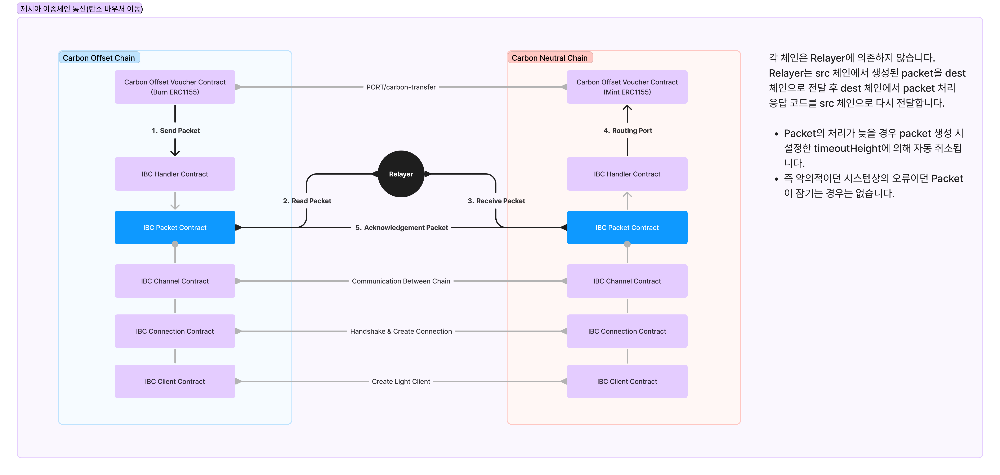

# Demo of ERC1155 bridging between heterogeneous chains for GESIA

IBC-based heterogeneous chain communication
<br/>
(https://www.ibcprotocol.dev)

significant portion of the golang implementation is implemented in solidity.
<br/>
(https://github.com/cosmos/ibc-go)

## Diagram



## Test

### 1. Build & Run Chains & Migration

```bash
# install all dependencies
npm install

# complie all contracts
npm run compile

# run neutral, emissions, offset chains
cd chains && docker compose up -d --build && cd ..

# migrate all contracts for each chains
npm run migrate:neutral
npm run migrate:emissions
npm run migrate:offset
```

### 2. Setup Relayer

### Pre Check Points

1. migrate log에 확인되는 `OwnableIBCHandler` 주소, `relayer/configs/**/chains/**`의 field `ibc_address`에 업데이트 하세요.

2. relayer를 여러번 연결하여 Client, Channel, Connection이 중복 생성되는 경우 id sufflix 숫자를 1씩 업데이트 하세요.


```bash
### Processing

```bash
cd relayer

# build relayer binary for linux/amd64
GOARCH=amd64 GOOS=linux go build -o ./relayer .

# you can up with -d (background) option
docker compose up emissions_neutral --build
# docker compose up offset_neutral --build

cd ..
```

### 3. Test

test file의 channel은 다시 확인해주세요.

```bash
yarn truffle exec test/neutral.test.js --network neutral
yarn truffle exec test/calc.emissions.test.js --network emissions

yarn truffle exec test/calc.js --network emissions

yarn truffle exec test/calc.emissions.test.js --network emissions
yarn truffle exec test/neutral.test.js --network neutral


yarn truffle exec test/neutral.test.js --network neutral
yarn truffle exec test/donate.offset.test.js --network offset

yarn truffle exec test/donate.js --network offset

yarn truffle exec test/donate.offset.test.js --network offset
yarn truffle exec test/neutral.test.js --network neutral
```
